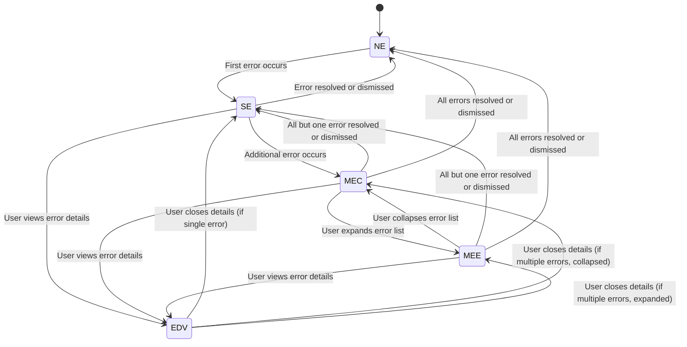

<!-- docs/error-handling.md -->

# Error Handling UX Requirements Document

## Overview

This document outlines the user experience requirements for error handling in the LiveDocs application. It defines the various states of error display and interaction, as well as the transitions between these states. The requirements are based on the design principles outlined in DESIGN.md and the current implementation of the ErrorHandler component, focusing on desktop/laptop users.

## Error Display States

We define the following key states for error handling:

1. No Errors (NE)
2. Single Error (SE)
3. Multiple Errors - Collapsed (MEC)
4. Multiple Errors - Expanded (MEE)
5. Error Details View (EDV)

## State Machine Definition

## UX Requirements for Each State

### 1. No Errors (NE)

- No error UI elements should be visible.
- The application should function normally without any error indicators.
- State Transitions:
  - When the first error occurs, transition to Single Error (SE) state.

### 2. Single Error (SE)

- A single error alert should be displayed in the top-right corner of the screen.
- The alert should contain:
  - Error type as the title (e.g., "NETWORK Error")
  - A brief error message (truncated to 50 characters if necessary)
  - A "View Details" button
  - A "Dismiss" button
- The alert should use appropriate colors based on error severity (error: red, warning: amber, info: blue).
- The alert should animate into view using a slide-in animation from the top.
- The alert should have rounded corners with a radius that does not obscure any text content.
- All buttons should be fully visible and clickable at all times when the alert is displayed.
- State Transitions:
  - When the error is resolved or dismissed, transition to No Errors (NE) state.
  - When an additional error occurs, transition to Multiple Errors - Collapsed (MEC) state.
  - When the user clicks "View Details", transition to Error Details View (EDV) state.

### 3. Multiple Errors - Collapsed (MEC)

- Up to three error alerts should be visible, stacked vertically in the top-right corner.
- Each alert should follow the same format as in the Single Error state, including a "Dismiss" button.
- A "Show X More" button should be visible below the last alert, where X is the number of additional errors.
- A "Dismiss All" button should be visible below the "Show X More" button.
- Alerts should be grouped by error type, with a count indicator for each group.
- All buttons should be fully visible and clickable.
- There should be sufficient spacing between alerts to ensure all buttons are accessible.
- State Transitions:
  - When the user clicks "Show X More", transition to Multiple Errors - Expanded (MEE) state.
  - When all but one error are resolved or dismissed, transition to Single Error (SE) state.
  - When all errors are resolved or dismissed, transition to No Errors (NE) state.
  - When the user clicks "View Details" on any error, transition to Error Details View (EDV) state.

### 4. Multiple Errors - Expanded (MEE)

- All error alerts should be visible, stacked vertically in the top-right corner.
- Each alert should follow the same format as in the Single Error state, including a "Dismiss" button.
- A "Show Less" button should be visible below the last alert.
- A "Dismiss All" button should be visible below the "Show Less" button.
- Alerts should be grouped by error type, with a count indicator for each group.
- The transition between MEC and MEE should be animated smoothly.
- If the expanded list extends beyond the viewport, it should be scrollable, ensuring all alerts and buttons remain accessible.
- The "Show Less" and "Dismiss All" buttons should always be visible, either at the bottom of the list or fixed at the bottom of the viewport if scrolling is necessary.
- State Transitions:
  - When the user clicks "Show Less", transition to Multiple Errors - Collapsed (MEC) state.
  - When all but one error are resolved or dismissed, transition to Single Error (SE) state.
  - When all errors are resolved or dismissed, transition to No Errors (NE) state.
  - When the user clicks "View Details" on any error, transition to Error Details View (EDV) state.

### 5. Error Details View (EDV)

- A modal dialog should appear centered on the screen, overlaying the main content.
- The dialog should contain:
  - A title with the error type
  - The full error message
  - Error context information
  - Detailed error information in a scrollable container
  - Additional information and stack trace (if available)
  - A "Close" button at the bottom of the dialog
  - An "X" icon or "Close" button in the top-right corner
- The dialog should animate into view using a fade-in animation.
- The background should be partially obscured with a semi-transparent overlay.
- The dialog should have rounded corners that do not obscure any content.
- The "Close" buttons should always be visible, either at the bottom of the dialog or fixed at the top and bottom if the content is scrollable.
- The dialog should not extend beyond the viewport edges, ensuring the "Close" buttons are always accessible.
- State Transitions:
  - When the user closes the dialog (via any close method) and there's only one error, transition to Single Error (SE) state.
  - When the user closes the dialog and there are multiple errors in collapsed view, transition to Multiple Errors - Collapsed (MEC) state.
  - When the user closes the dialog and there are multiple errors in expanded view, transition to Multiple Errors - Expanded (MEE) state.

## Interaction Requirements

1. Error Occurrence:

   - When an error occurs, the application should transition from NE to SE, or from SE/MEC/MEE to MEC/MEE as appropriate.
   - New errors should animate into view.
   - The appearance of new errors should not obscure or make inaccessible any existing UI elements or buttons.

2. Error Resolution:

   - When an error is resolved, it should be removed from the display.
   - If it's the last error, transition to NE.
   - If other errors remain, transition to SE, MEC, or MEE as appropriate.
   - The removal of errors should not cause abrupt layout shifts that could lead to accidental clicks.

3. Expanding/Collapsing Multiple Errors:

   - Clicking "Show X More" should transition from MEC to MEE.
   - Clicking "Show Less" should transition from MEE to MEC.
   - This transition should be animated smoothly.
   - During the transition, all buttons should remain clickable and should not be obscured by other elements.

4. Viewing Error Details:

   - Clicking "View Details" on any error alert should open the Error Details View (EDV).
   - The EDV should display details for the specific error that was clicked.
   - Opening the EDV should not cause other error alerts to become inaccessible or unclickable.

5. Closing Error Details:

   - The EDV should be closeable by:
     a) Clicking the "Close" button at the bottom of the dialog
     b) Clicking the "X" icon or "Close" button in the top-right corner
     c) Clicking outside the dialog area
     d) Pressing the Esc key on the keyboard
   - The state should return to SE, MEC, or MEE, depending on the number of active errors and their current display state.
   - The "Close" buttons should always be visible and clickable, even if the error details content is long and requires scrolling.

6. Accessibility:

   - All interactive elements should be keyboard accessible.
   - Error alerts and the EDV should have appropriate ARIA labels and roles.
   - Color alone should not be used to convey error severity; icons should also be used.
   - Focus should be managed appropriately when opening and closing the EDV, ensuring that keyboard users can easily navigate the interface.

7. Dismissing Errors:

   - Clicking the "Dismiss" button on an individual error should remove that error from the display.
   - If it's the last error, transition to NE.
   - If other errors remain, transition to SE, MEC, or MEE as appropriate.
   - The "Dismiss All" button should clear all errors and transition to NE.
   - Dismissing errors should trigger a subtle fade-out animation.

8. Dialog Interaction:

   - When the EDV is open, focus should be trapped within the dialog for keyboard navigation.
   - Upon closing the EDV, focus should return to the element that opened it (e.g., the "View Details" button).

9. Button Visibility:

   - All interactive buttons ("View Details", "Dismiss", "Show More"/"Show Less", "Dismiss All") should remain fully visible and clickable at all times.
   - If content scrolling is necessary, implement a sticky header and/or footer to ensure critical buttons remain accessible.
   - Use appropriate contrast and hover states to make buttons stand out from the background.

10. Keyboard Navigation:
    - Implement logical tab order for all interactive elements.
    - Use clear focus indicators for all interactive elements.
    - Allow using Enter or Space key to activate buttons and controls.

## Performance Requirements

1. Error Display Latency:

   - New errors should be displayed within 100ms of occurrence.
   - Transitions between states should complete within 300ms.

2. Smooth Animations:

   - All animations should run at 60fps on modern desktop browsers.

3. Scalability:
   - The system should handle up to 100 simultaneous errors without significant performance degradation.

## Design Requirements

1. Desktop (13" to 27" screens):

   - Error alerts should have a maximum width of 400px.
   - EDV should occupy up to 80% of the screen width, centered.
   - Ensure that all text is legible on both smaller (13") and larger (27") screens without requiring zooming.
   - Use responsive units (e.g., em, rem) for font sizes and spacing to maintain consistency across different screen resolutions.

2. High-DPI Screens:

   - Ensure all icons and graphical elements are crisp on high-DPI displays.
   - Use SVG icons where possible to maintain quality at all resolutions.

3. Input Devices:

   - Optimize for mouse and keyboard input, ensuring all interactive elements have clear focus states.
   - Implement keyboard shortcuts for common actions (e.g., closing the EDV with the Esc key).

4. Multi-Monitor Support:

   - Ensure the error handling UI behaves correctly when the application window is moved between monitors with different resolutions or DPI settings.

5. Button Design:

   - Use consistent button styling across all error states and the EDV.
   - Ensure buttons have sufficient touch target size (minimum 44x44 pixels) for easy interaction.
   - Implement clear hover and focus states for all buttons.
   - Use icons in conjunction with text for critical actions (e.g., a trash icon for "Dismiss All").

6. Z-index Management:
   - Ensure error alerts and the EDV always appear on top of other UI elements.
   - Implement proper stacking context to prevent z-index conflicts with other components.

## Testing Scenarios

1. Trigger a single error and verify SE state.
2. Trigger multiple errors and verify MEC state.
3. Expand multiple errors and verify MEE state.
4. View details of an error in each state (SE, MEC, MEE) and verify EDV state.
5. Resolve errors one by one, verifying correct state transitions.
6. Simulate rapid occurrence of multiple errors to test performance.
7. Test all interactions using both mouse and keyboard.
8. Verify all states and transitions on various screen sizes (13" to 27").
9. Verify that all buttons remain clickable and visible in all states and during all transitions.
10. Test that the "Close" button in the EDV remains accessible when the error details content is very long.
11. Ensure that corner rounding does not obscure any text in error alerts or the EDV.
12. Verify that the appearance or disappearance of error alerts does not cause other UI elements to become inaccessible.
13. Test the error handling UI on high-DPI displays to ensure clarity and crispness of all elements.
14. Verify correct behavior when using the application across multiple monitors with different resolutions.
15. Test dismissing individual errors in SE, MEC, and MEE states.
16. Verify the functionality of the "Dismiss All" button in MEC and MEE states.
17. Test all methods of closing the EDV (close buttons, clicking outside, Esc key).
18. Verify correct focus management when opening and closing the EDV.
19. Test keyboard navigation through all error states and the EDV.
20. Verify that all buttons remain visible and functional when content requires scrolling.
21. Verify all state transitions as defined in the State Machine Definition, ensuring they align with the UX Requirements for Each State.
22. Test edge cases, such as transitioning from MEE to SE when dismissing all but one error.

## Conclusion

This document provides a comprehensive set of UX requirements for error handling in the LiveDocs application, tailored for desktop/laptop users. By following these requirements, the error handling system should provide a consistent, informative, and user-friendly experience across all error scenarios. This error handling system now includes comprehensive dismiss functionality and ensures all interactive elements are consistently visible and accessible, providing users with full control over their error management experience. UX QA engineers should use this document as a reference when verifying the implementation of the error handling system.
